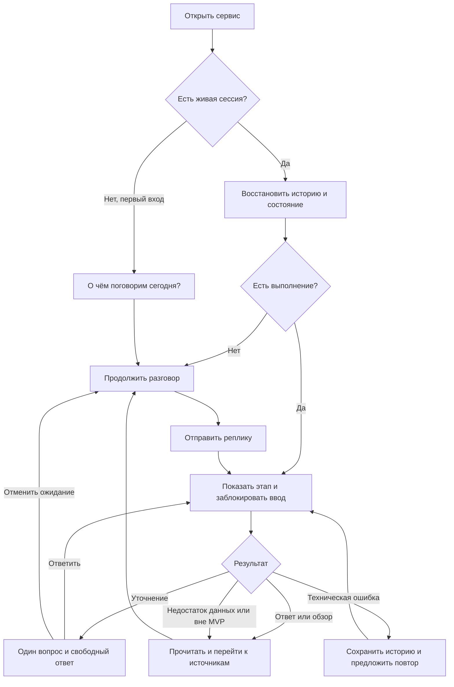

# U-01: пользовательские потоки и матрица экранов

Дата: 2026-09-22. Статус: U-01 закрыта. Потоки и матрица подготовлены; браузеры и экраны
согласованы владельцем. Критерии доступности предложены для приёмки в A-11. Основания: [цели](purpose.md),
[архитектура](architect.md), [жизненный цикл](session-lifecycle.md),
[утверждённая концепция](../ui/concept.md).
Визуальное представление: [интерактивные макеты U-02](../ui/chat-prototype.html).

## Основной поток

Реплика может быть вопросом или обращением к роли без вопроса. Backend выбирает
роль по контексту; смена роли не создаёт новый разговор. Очень широкий вопрос
получает доступный обзор, а не анкету. Если без уточнения возможна существенная
ошибка, допускается один раунд; после неразрешённого уточнения показываются
варианты/ограничение, повторный раунд по тому же запросу не запускается.
При смене предмета во время уточнения backend снимает прежнее ожидание.

## Возвращение, ошибка и завершение

- Refresh → восстановить snapshot → продолжить опрос существующего выполнения
  либо показать готовый ответ/ожидающее уточнение. Отправка заново не производится.
- Потеря связи → сохранить доступную историю, заблокировать новую отправку до
  проверки состояния → «Восстановить связь» → восстановление. Сетевой таймаут
  не доказывает, что запрос не был принят.
- Подтверждённая ошибка выполнения → «Повторить обработку». Протокол повторного
  выполнения определяет API; сетевой повтор доставки использует прежний request_id.
  Это разные ситуации, интерфейс не обещает запустить новое выполнение повтором
  завершённого request_id.
- Истечение/очистка в другой вкладке/рестарт API → сообщение об утрате → явное
  «Начать новый диалог». Если причина не установлена, не утверждать, что это именно TTL.
- «Очистить диалог» → подтверждение → удаление на API → пустой экран. При ошибке
  остаются история и источники; доступен повтор. Очистка доступна при обработке.
- Источники → меню карточки → первичный ответ; открытие URL всегда в новой вкладке.
  Точные повторения URL не создают карточки; комментарий и первичная привязка сохраняются.
- Сохранение диалога/источников → файл на устройство; пустые действия недоступны,
  ошибка не удаляет данные. Подробная семантика — в жизненном цикле, здесь не дублируется.

## Матрица состояний

Номера соответствуют переключателю макета. Это отдельные состояния для просмотра,
не последовательность автоматического сценария или доказательство работы API.

| Экран | Триггер и содержание | Доступные действия и переход |
|---|---|---|
| 01 Новый диалог | Новая сессия, нейтральный вопрос без имени | Пример → редактирование; отправка → 03/04; настройки |
| 02 История | Готовые ответы с неизменными именами, текущая роль отдельно | Уточнение/смена темы → 04; источники; экспорт; очистка |
| 03 Очередь | queued | Ввод и отправка заблокированы; чтение и очистка доступны |
| 04 Анализ | analyzing; роль ещё определяется | Как 03, затем выбор роли и следующая стадия |
| 05 Поиск | searching | «Ищу источники», без внутренних рассуждений |
| 06 Сопоставление | building_evidence | «Сопоставляю материалы» |
| 07 Подготовка | generating | «Готовлю ответ», без черновиков генерации |
| 08 Проверка | validating | «Проверяю ответ», затем результат или 12 |
| 09 Уточнение | awaiting_clarification | Свободный текст, варианты, отмена ожидания; ввод доступен |
| 10 Обзор | Широкий вопрос | Связный обзор с направлениями продолжения; ввод доступен |
| 11 Потеря связи | Результат доставки/выполнения неизвестен | Восстановление → 13; сохранение видимой истории; без новой отправки |
| 12 Ошибка обработки | Подтверждённый failed | Повтор обработки либо новый вопрос; история сохранена |
| 13 Восстановление | Открытие/refresh/reconnect | Ввод заблокирован до snapshot; затем актуальное состояние |
| 14 Сессия утрачена | closed/недоступная сессия | Явный новый диалог; старые источники не выдаются за живые |
| 15 Очистка | Явное действие | «Оставить диалог» / «Очистить диалог»; отмена закрывает окно |
| 16 Ошибка очистки | Удаление не подтверждено | Сохранить экран, предложить повтор; не создавать новую сессию |
| 17 Ошибка настроек | Запись не удалась | Сообщить прежние действующие значения; повтор сохранения |
| 18 Недостаточно сведений | insufficient_evidence / limited | Пробелы и возможное уточнение без выдуманных сведений |
| 19 Вне MVP | out_of_scope | Краткое объяснение и образовательное продолжение |
| 20 Обращение к роли | «Хочу поговорить с…» | Приглашение от выбранного ассистента, без фиктивных источников |
| 21 Ошибка экспорта | Не удалось сохранить файл | Понятное сообщение и повтор; диалог остаётся |
| 22 Другая вкладка занята | session_busy, активное выполнение | Восстановить блокировку и статус; не добавлять отклонённую реплику |

При ожидании настройки в макете недоступны: это предложенная детализация UX,
согласуемая при контракте настроек. Отдельной остановки активного выполнения нет.
Никаких процентов прогресса и обещаний времени без фактических данных API.

## Покрытие сценариев MVP-1

| Сценарий | Путь по экранам | Проверяемый результат |
|---|---|---|
| US-01 Понятие | 01 → 04–08 → 02 | Понятное объяснение и источники |
| US-02 Сравнение | 02 → 04–08 → 02 | Общие критерии сравнения внутри ответа |
| US-03 Первенство | 01 → 04–08 → 10 | Разные трактовки без ложного единственного ответа |
| US-04 Исторический обзор | 01 → 04–08 → 10 | Связный обзор, возможность сузить период |
| US-05 Об этом авторе | 02 → 04 → 09 либо 05–08 → 02 | Контекст разрешает ссылку; уточнение только при необходимости |
| US-06 Даты произведения | 02 → 04–08 → 02/18 | Создание и публикация различимы, пробел обозначен |
| US-07 Проверка тезиса | 02 → 04–08 → 02/18 | Возможно опровержение предпосылки; подтверждения связаны с текстом |
| US-08 Объясни проще | 02 → 04–08 → 02 | Предмет сохранён; настройки относятся к следующим ответам |
| US-09 Где почитать | 02 → 04–08 → 02 → источники | Контекст карточки и возврат к первичному ответу |
| US-10 Противоречия | 02 → 04–08 → 02/18 | Версии и основания различимы; детальная карточка — U-03 |
| US-11 Смена темы | 02 → 04–08 → 02 | Имя нового ассистента, прежние подписи и ссылки сохранены |
| US-12 Очистка | Любое живое → 15 → 01/16 | Подтверждение; ошибка не стирает экран; поздний ответ не возвращается |

Текстовые примеры в макете иллюстрируют композицию. Это не эталонный корпус
исторической достоверности; его готовят эксперт и QA. Детальные доказательства,
карточки противоречий и обратная связь остаются в U-03.

## Язык, экраны и доступность

Язык интерфейса и ответов — русский (утверждено владельцем 2026-09-23).
Обращение на «вы» остаётся предложением для A-11.

UI проектируется для локализации: пользовательские строки, подписи тем/ролей,
ошибки и доступные названия элементов отделены от стабильных кодов и компонентов.
Локаль берётся из настроек сессии API; язык введённого текста её не меняет.
Она определяет язык ответа и представления предметной области вопроса.
В MVP-1 поддерживается только ru, переключатель языка не требуется.
Вёрстка должна допускать изменение длины переведённых строк.
Сценарии проверки: иноязычная реплика при ru получает русский ответ;
refresh сохраняет локаль; история и исходные цитаты не переписываются.
[Семантика API](contracts.md#язык-и-локализация).

Владелец согласовал поддержку браузеров на движках Chromium, WebKit и Gecko.
Основные проверки выполняются в Google Chrome и Apple Safari на этом Mac.
Если нужна проверка Firefox/Gecko, запросить её у владельца: он проверит на другом ПК.
Прохождение Chrome/Safari не считается проверкой Gecko.

| Приоритет | Среда | Размеры и ориентация |
|---|---|---|
| Основной | Desktop Chrome и Safari | HD 1280 × 720, Full HD 1920 × 1080, 4K 3840 × 2160; landscape |
| Мобильный веб | Браузер Android | 360 × 800 и 390 × 844; portrait |
| По необходимости | Firefox на другом ПК владельца | Проверка совместимости Gecko, по согласованному сценарию |

HD/Full HD/4K здесь трактуются как 720p/1080p/UHD. При отчёте отдельно фиксировать
разрешение дисплея и фактическую область страницы в CSS px: панели браузера,
масштаб ОС, масштаб страницы и devicePixelRatio влияют на неё. Эмуляция viewport
не заменяет проверку реального дисплея, браузера Android или экранной клавиатуры.
Для воспроизводимой проверки макета использовать также viewport указанных размеров.
320 px и увеличение текста остаются дополнительными проверками устойчивости,
не отдельным согласованным мобильным устройством.

Специальное мобильное приложение и дизайн для него не требуются.
Предыдущие проверки 1440/1024/390/320 px в Chrome остаются результатами прежнего
прохода и не объявляются проверкой новой матрицы или Safari.

### Мобильные панели — предложенная детализация

В верхней строке две иконки: меню и источники. Обе имеют доступные названия,
подсказки и область нажатия не меньше 44 × 44 px; имя ассистента остаётся видимым.
При ширине до 760 px обе боковые области скрыты. По нажатию выбранная панель
открывается поверх диалога под верхней строкой; другая закрывается. Повторное
нажатие, явное закрытие или Escape возвращают диалог без потери текста и места чтения.
Переход «Перейти к диалогу» закрывает источники и фокусирует первичный ответ.

Основной способ открытия — кнопки. Свайп и анимация выдвижения могут быть добавлены
позднее; они не обязательны для выполнения действия. Макет показывает вариант
с наложением панелей. Для frontend: при открытии ограничить фокус активной панелью
и кнопками переключения, скрыть перекрытое содержимое от взаимодействия.
На промежуточной ширине до 1150 px только левое меню свёрнуто; на широком экране
сохраняются три области. Пороги относятся к текущему макету и уточняются вёрсткой.

### Предлагаемые критерии доступности

Критерии: без горизонтального скролла на 320 px; текст увеличивается до 200%;
контраст обычного текста не ниже 4,5:1; видимый фокус; основные цели не меньше
44 × 44 px; роль и ошибки обозначаются текстом, а не только цветом.

Enter вводит новую строку, Ctrl/⌘ + Enter отправляет; кнопка отправки всегда есть.
Поле растёт от 4 до 7 видимых строк, затем прокручивается. Меню и подтверждение
доступны с клавиатуры, Escape закрывает; фокус возвращается к вызвавшему элементу,
а при переходе из карточки — к первичному ответу. Статусы озвучиваются без чтения
всего диалога заново. При чтении старой реплики новый ответ не должен принудительно
перемещать пользователя вниз; предусмотреть действие «К новому ответу» в реализации.

## Готовность и зависимости

U-01 закрыта: потоки, матрица, покрытие US-01–US-12 готовы, устройства и браузеры
согласованы, параметры доступности предложены согласно критерию задачи.
Это не означает прохождения всех браузерных проверок или закрытия A-11 целиком.
U-02: макеты доступны для начала frontend-разработки и подготовки тестов.
Детальная проработка ответа, доказательств и обратной связи остаётся в U-03;
проверка работающего Streamlit UI — в U-04/F-06/T-05.

Frontend может начинать оболочку чата, адаптивную компоновку и состояния по макетам.
QA может готовить сценарии и браузерную матрицу. Контракты ролей, экспорта и сессии
требуют согласования перед интеграцией; они не блокируют работу на макетных данных.
Открытые технические вопросы ведутся только в [decisions.md](decisions.md).
